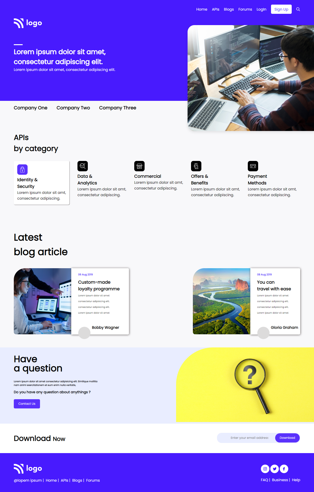

# Developer Agency Landing Page

**Hi everyone, I am Raushan Kumar**

This webpage is a landing page of a Developer Agency build purely in HTML and CSS.

> This landing page was very challenging to complete and took around `4-5 hours` to complete😉. It was such of a kind of website I have build till now. Unlike, last projects every content was on the full screen viewport, this project had its content distributed over several page scree viewport. It was really interesting with dealing such design patterns. The page also contained cards in it and it was also the first time I was implementing them😃.

- Key learning from the project👇
    - using `Positions` to position images properly
    - designing beautiful navbars and footer
    - using `flex` properties inside another `flex`

Below is the view and link of the page👇👇👇
[Developer Mania](developermania.netlify.app)

    